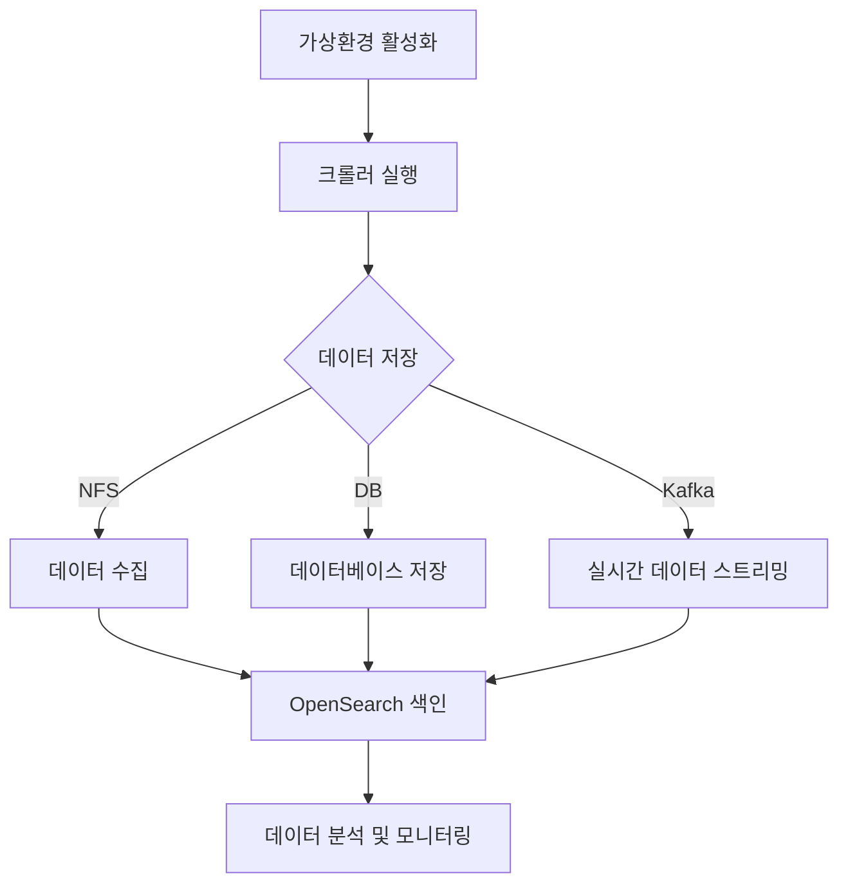

# Consensus ETL Crawler - Private Cloud 배포 가이드

## 1. 사전 준비사항

### 1.1 접속 정보
- **SSH 접속**: `ssh root@finsight.kro.kr -p 30022`
- **배포 대상 서버**: node1, node2, node3 (3개 노드에 분산 배포)

### 1.2 필요한 계정
- `etluser`: ETL 작업용 계정 (패스워드: ai123!)
- `svcmon`: 서비스 모니터링용 계정

## 2. 배포 단계

### 2.1 파일 업로드

#### 방법 1: NFS 공유 디렉토리 직접 배포 (권장)
```bash
# Node3 NFS 호스트에 직접 배포 (모든 노드에서 공유 사용)
# 1. NFS 디렉토리 생성
ssh etluser@finsight-node3-root.kro.kr "mkdir -p /nfs/consensus-etl"

# 2. 프로젝트 파일들 업로드
scp -r project/* etluser@finsight-node3-root.kro.kr:/nfs/consensus-etl/
scp *.sh etluser@finsight-node3-root.kro.kr:/nfs/consensus-etl/
scp consensus_etl_dag.py etluser@finsight-node3-root.kro.kr:/nfs/consensus-etl/
scp DEPLOYMENT_GUIDE.md etluser@finsight-node3-root.kro.kr:/nfs/consensus-etl/

# 3. 권한 설정
ssh etluser@finsight-node3-root.kro.kr "chmod -R 755 /nfs/consensus-etl/"

# 4. 배포 확인
ssh etluser@finsight-node3-root.kro.kr "ls -la /nfs/consensus-etl/"
```

**📂 디렉토리 구조 설명:**

#### NFS 직접 배포 방식 (권장):
- `/nfs/consensus-etl/` - **프로젝트 소스코드** (모든 노드에서 공유 사용)
- `/app/miniconda3/envs/etl/` - Python 가상환경 (각 노드별 로컬)
- `/nfs/consensus-data/` - 데이터 저장 디렉토리 (NFS 공유 스토리지)

#### Gate 서버 경유 방식 (선택):
- `/home/etluser/consensus-etl-deploy/` - 임시 배포 디렉토리 (Gate 서버)
- `/app/consensus-etl/` - 실제 운영 디렉토리 (각 노드별 복사)
- `/app/miniconda3/envs/etl/` - Python 가상환경 (각 노드별 로컬)

**🔧 가상환경과 프로젝트 분리 구조:**

#### NFS 직접 배포 방식:
```
📁 가상환경 (각 노드별): /app/miniconda3/envs/etl/
├── bin/python              ← Python 실행파일
├── lib/python3.11/         ← 설치된 패키지들
└── site-packages/
    ├── selenium/
    ├── requests/
    └── pandas/

📁 프로젝트 (NFS 공유): /nfs/consensus-etl/
├── crawling/               ← 크롤러 소스코드
│   ├── bnk_con_crawler.py
│   ├── config.py
│   └── data_pipeline.py
├── requirements.txt        ← 패키지 목록
└── run_crawler.sh         ← 실행 스크립트
```

#### Gate 서버 경유 방식:
```
📁 가상환경 (각 노드별): /app/miniconda3/envs/etl/
📁 프로젝트 (각 노드별): /app/consensus-etl/
```

**💡 실행 원리:**

#### NFS 직접 배포 방식:
- 각 노드의 가상환경(`/app/miniconda3/envs/etl/`)의 Python이 
- NFS 공유 디렉토리(`/nfs/consensus-etl/`)의 소스코드를 실행

#### Gate 서버 경유 방식:
- 각 노드의 가상환경(`/app/miniconda3/envs/etl/`)의 Python이 
- 각 노드의 로컬 디렉토리(`/app/consensus-etl/`)의 소스코드를 실행

### 2.2 서버에서 배포 실행
```bash
# 1. gate 서버 접속
ssh root@finsight.kro.kr -p 30022

# 2. node1으로 이동
ssh node1

# 3. 배포 디렉토리로 이동 및 배포 스크립트 실행
cd /home/etluser/consensus-etl-deploy
chmod +x deploy_to_cloud.sh
chmod +x run_crawler.sh
./deploy_to_cloud.sh
```

### 2.3 환경별 설정

#### A. Python 환경 설정 (Private Cloud 가이드라인 준수)
```bash
# 1. 기존 환경 조회 (root 계정으로)
sudo conda env list

# 2. 기존 etl 환경 확인 (이미 존재하는 경우)
ls -la /app/miniconda3/envs/etl

# 3. 신규 환경 생성 (etl 환경이 없는 경우만)
sudo conda create -n etl python=3.11 -y

# 4. 권한 설정 (Private Cloud 가이드라인)
sudo setfacl -R -m user::rwx /app/miniconda3

# 5. 패키지 설치 (fullpath 사용)
# 5-1. 현재 설치된 패키지 확인
/app/miniconda3/envs/etl/bin/python -m pip list

# 5-2. pip 업그레이드
/app/miniconda3/envs/etl/bin/python -m pip install --upgrade pip

# 5-3. 크롤링에 필요한 추가 패키지 설치
/app/miniconda3/envs/etl/bin/python -m pip install selenium beautifulsoup4 pdfplumber mariadb webdriver-manager pillow opencv-python pytesseract lxml undetected-chromedriver PyPDF2

# 또는 requirements.txt 전체 설치 (이미 설치된 것은 스킵됨)
/app/miniconda3/envs/etl/bin/python -m pip install -r requirements.txt

# 6. 환경 확인
/app/miniconda3/envs/etl/bin/python --version
/app/miniconda3/envs/etl/bin/python -m pip list
```

**📝 Private Cloud Python 환경 관리 원칙:**
- ✅ **기존 환경 활용**: `etl` 환경이 이미 존재하므로 재사용
- ✅ **환경 생성**: root 계정으로 `conda create` 실행 (필요시)
- ✅ **권한 설정**: `setfacl -R -m user::rwx /app/miniconda3` 실행
- ✅ **실행 시**: fullpath 사용 (`/app/miniconda3/envs/etl/bin/python`)
- ✅ **패키지 설치**: fullpath로 `python -m pip install` 실행

#### B. Chrome 설치 (Headless 환경)
```bash
# Chrome 저장소 추가
sudo tee /etc/yum.repos.d/google-chrome.repo <<EOF
[google-chrome]
name=google-chrome
baseurl=http://dl.google.com/linux/chrome/rpm/stable/x86_64
enabled=1
gpgcheck=1
gpgkey=https://dl.google.com/linux/linux_signing_key.pub
EOF

# Chrome 설치
sudo yum install -y google-chrome-stable
```

#### C. 데이터베이스 설정
```bash
# MariaDB 접속하여 데이터베이스 생성
mysql -h finsight.kro.kr -P 2503 -u etluser -p

# 데이터베이스 및 테이블 생성
CREATE DATABASE IF NOT EXISTS consensus_db CHARACTER SET utf8mb4 COLLATE utf8mb4_unicode_ci;
USE consensus_db;

# 테이블은 data_pipeline.py에서 자동 생성됨
```

## 3. Airflow 설정

### 3.1 DAG 파일 배포
```bash
# Airflow DAG 디렉토리에 복사
cp /app/consensus-etl/consensus_etl_dag.py /app/airflow/dags/

# Airflow 스케줄러 재시작
sudo systemctl restart airflow-scheduler
```

### 3.2 Connection 설정
Airflow UI에서 다음 Connection들을 설정:

#### MariaDB Connection
- Connection Id: `consensus_mariadb`
- Connection Type: `MySQL`
- Host: `finsight.kro.kr`
- Port: `2503`
- Schema: `consensus_db`
- Login: `etluser`
- Password: `data123!`

#### Kafka Connection
- Connection Id: `consensus_kafka`
- Connection Type: `HTTP`
- Host: `finsight.kro.kr`
- Port: `31992`

## 4. 실행 및 모니터링

### 4.1 수동 실행
```bash
# 1. NFS 프로젝트 디렉토리로 이동 (소스코드 위치)
cd /nfs/consensus-etl

# 2. fullpath Python으로 개별 크롤러 실행
/app/miniconda3/envs/etl/bin/python crawling/bnk_con_crawler.py

# 3. 또는 실행 스크립트 사용 (권장)
./run_crawler.sh bnk          # BNK 크롤러만 실행
./run_crawler.sh all          # 모든 크롤러 실행
```

**🔧 실행 방식 설명:**
- 가상환경(`/app/miniconda3/envs/etl/`)의 Python 사용 (fullpath)
- NFS 공유 디렉토리(`/nfs/consensus-etl/`)의 소스코드 실행
- 데이터는 NFS(`/nfs/consensus-data/`)에 저장

**📊 서비스 접속 정보:**
- **Kafka**: `finsight.kro.kr:31992,32992,33992` (3개 노드 클러스터)
- **MariaDB**: `finsight.kro.kr:2503` (etluser/data123!)
- **OpenSearch**: `https://finsight.kro.kr:39211` (admin/data123!)
- **Redis**: `finsight.kro.kr:33311,33312` (2개 노드, pw:data123!)
- **PostgreSQL**: `finsight.kro.kr:35000` (vector_mgr/vector123!)
- **MinIO**: `https://finsight.kro.kr:35600` (admin/data123!)

### 4.2 Airflow를 통한 스케줄 실행
- Airflow UI: `https://finsight.kro.kr:35600` → airflow
- DAG 이름: `consensus_etl_pipeline`
- 스케줄: 평일 오전 9시 (KST)

### 4.3 모니터링
```bash
# 로그 확인
tail -f /nfs/consensus-data/logs/crawler_*.log

# 데이터 확인
mysql -h finsight.kro.kr -P 2503 -u etluser -p -e "SELECT COUNT(*) FROM consensus_db.consensus_data;"

# Kafka 메시지 확인
/app/kafka/bin/kafka-console-consumer.sh \
  --bootstrap-server finsight.kro.kr:31992 \
  --topic consensus-data \
  --from-beginning
```

## 5. 운영 고려사항

### 5.1 고가용성
- 3개 노드에 동일하게 배포하여 장애 대응
- L4 로드밸런서를 통한 분산 처리
- NFS를 통한 공유 스토리지 사용

### 5.2 보안
- 루트 계정 사용 최소화
- etluser 계정으로 서비스 실행
- 방화벽 설정 확인

### 5.3 백업
```bash
# 데이터 백업 스크립트
#!/bin/bash
DATE=$(date +%Y%m%d)
mysqldump -h finsight.kro.kr -P 2503 -u etluser -p consensus_db > /nfs/consensus-data/backups/consensus_db_${DATE}.sql
```

### 5.4 확장성
- 크롤러별 독립적 실행으로 수평 확장 가능
- Kafka를 통한 실시간 데이터 스트리밍
- OpenSearch를 통한 검색 및 분석 기능 확장

## 6. 트러블슈팅

### 6.1 Chrome 관련 오류
```bash
# Chrome 의존성 설치
sudo yum install -y libX11 libXcomposite libXcursor libXdamage libXext libXi libXtst cups-libs libXScrnSaver libXrandr GConf2 alsa-lib atk gtk3 ipa-gothic-fonts xorg-x11-fonts-100dpi xorg-x11-fonts-75dpi xorg-x11-utils xorg-x11-fonts-cyrillic xorg-x11-fonts-Type1 xorg-x11-fonts-misc
```

### 6.2 권한 문제
```bash
# 파일 권한 설정
sudo chown -R etluser:etluser /app/consensus-etl
sudo chown -R etluser:etluser /nfs/consensus-data
```

### 6.3 네트워크 문제
```bash
# 방화벽 확인
sudo firewall-cmd --list-all

# 포트 테스트
telnet finsight.kro.kr 2503
```

### 2.4 다중 노드 배포 (권장)

고가용성을 위해 모든 노드에 동일하게 배포하는 방법:

```bash
# gate 노드에서 실행
ssh root@finsight.kro.kr -p 30022

# 다중 노드 배포 스크립트 실행
cd /home/etluser/consensus-etl-deploy
chmod +x deploy_multi_node.sh
./deploy_multi_node.sh
```

**📊 노드별 역할 분석:**
- **Node1**: API 서비스 + ETL (기존에 `api` 환경 존재)
- **Node2**: ETL 전용 (새로 `etl-crawler` 환경 생성)
- **Node3**: ETL 전용 + NFS 호스트 (새로 `etl-crawler` 환경 생성)

**🔍 배포 후 확인 방법:**
```bash
# 각 노드별 환경 확인
for node in node1 node2 node3; do
    echo "=== $node 환경 확인 ==="
    ssh $node "conda env list"
    ssh $node "ls -la /app/miniconda3/envs/"
done
```

## 📖 가상환경과 프로젝트 구조 이해

### 🤔 **왜 분리해서 관리하나요?**

**1. 가상환경 (Environment):**
- **목적**: Python 실행 환경 + 패키지 관리
- **위치**: `/app/miniconda3/envs/etl/`
- **내용**: Python 바이너리, 라이브러리, 패키지들
- **관리**: conda/pip으로 패키지 설치/제거

**2. 프로젝트 (Project):**
- **목적**: 비즈니스 로직 (소스코드)
- **위치**: `/app/consensus-etl/`
- **내용**: .py 파일들, 설정 파일, 스크립트
- **관리**: git으로 버전 관리, 배포로 업데이트

### 🔄 **실행 흐름:**


**설명:**
1. 가상환경을 활성화하면 필요한 Python 패키지와 라이브러리가 로드됩니다.
2. 크롤러를 실행하여 데이터를 수집합니다.
3. 수집된 데이터는 설정에 따라 NFS, 데이터베이스, Kafka 중 하나 또는 여러 곳에 저장됩니다.
4. NFS에 저장된 데이터는 주기적으로 백업됩니다.
5. 데이터베이스에 저장된 데이터는 SQL 쿼리를 통해 분석할 수 있습니다.
6. Kafka를 통해 실시간으로 스트리밍되는 데이터는 다른 시스템이나 서비스에서 즉시 사용할 수 있습니다.
7. OpenSearch에 색인된 데이터는 Kibana를 통해 시각화 및 분석할 수 있습니다.
8. 모든 데이터 흐름과 처리는 Airflow에 의해 스케줄링되고 모니터링됩니다.

## 🔍 ETL 환경 현황 (Node3 기준):
```bash
# Python 버전: 3.10.11
# 이미 설치된 주요 패키지들:
- ✅ requests (2.31.0)       # HTTP 요청
- ✅ pandas (2.2.3)          # 데이터 처리  
- ✅ numpy (2.2.6)           # 수치 계산
- ✅ kafka-python (2.2.9)    # Kafka 연동
- ✅ redis (6.1.0)           # Redis 연동
- ✅ python-dateutil (2.9.0) # 날짜 처리
- ✅ cryptography (45.0.3)   # 암호화
- ✅ PyYAML (6.0.2)          # 설정 파일

# 추가 설치 필요한 패키지들:
- ❌ selenium              # 웹 자동화
- ❌ beautifulsoup4        # HTML 파싱
- ❌ pdfplumber            # PDF 처리
- ❌ mariadb               # MariaDB 연결
- ❌ webdriver-manager     # Chrome 드라이버
```
